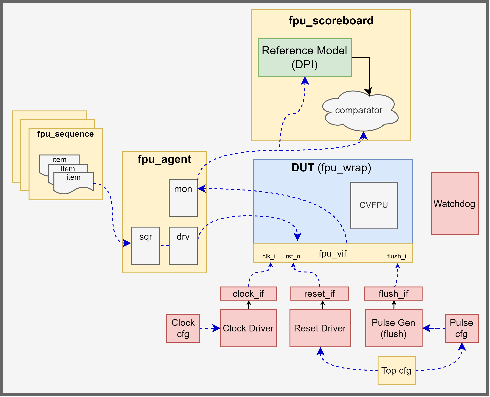

# CVFPU UVM Testbench

## 1. Project Overview
This repository contains a UVM Verification Environment for the [CVFPU](https://github.com/openhwgroup/cvfpu.git). DUT is the CVA6 wrapper of the floating-point unit.

## 2. Testbench Architecture



## 3. Project Structure
The repository is organised as follows:
- **docs/testplan/** Contains the testplan for the CVFPU UVM environment
- **env/** Contains UVM environment, scoreboard and top configuration classes
- **fpu_agent/** Contains UVM agent, driver, sequencer, monitor, interface, sequences and transaction item
- **fpu_common/** Contains package used accross UVM testbench
- **modules/** Contains dependencies of the project: [cva6](https://github.com/openhwgroup/cva6.git) and [core-v-verif](https://github.com/openhwgroup/core-v-verif.git) repositories. Both are included as git submodules.
- **ref_model_csim/** Contains C++ reference model as well as SystemVerilog wrapper
- **simu/** Contains regression test list and yaml files needed to run simulation and regression scripts. It also holds log files
- **tests/** Contains UVM test classes
- **top/** Contains top-level testbench file
- **scripts/** Contains `scan_logs.pl` perl script for parsing log files, reporting errors and warnings, and generating summary reports.

## 4. Getting started
### 4.1 Environment Setup
Before building or running the project, you must configure your environment variables. The testbench requires QuestaSim simulator, so ensure the `QUESTA_PATH` variable is set to your Questa installation directory.

**tcsh**
```
setenv QUESTA_PATH <questa_path> 
   # ex: setenv QUESTA_PATH <path_to_your_install>/questasim/2025.1
```
**bash**
```
export QUESTA_PATH=<questa_path>
```
We also provide two scripts to setup the project environment, source the one that matches the shell of the machine.

| Shell Type      | Command to Run         |
| --------------- | -----------------------|
| **csh/tcsh**    | `source setup_env.csh` |
| **bash/zsh/sh** | `source setup_env.sh`  |

Some of the testbench utilities (compilation, simulation and regression scripts) use Python. Dependencies are listed in `requirements.txt`.

### 4.2. Compile C++ Reference Model
Build the shared library `refmodel_csim_lib.so` used in the UVM testbench via DPI.

#### Dependencies
The following dependencies need to be installed in the system:

- **GMP** (GNU Multiple Precision Arithmetic Library)
- **MPFR** (Multiple Precision Floating-Point Reliable Library): Section [*2.1 How to Install*](https://www.mpfr.org/mpfr-current/mpfr.html) details the steps to follow to install the library, use preferably version **4.2.2**.

Set GMP/MPFR directory path variables in the environment.

**tcsh**
```
setenv GMP_DIR <gmp_dir_absolute_path>
setenv MPFR_DIR <mpfr_dir_absolute_path>
```
**bash**
```
export GMP_DIR=<gmp_dir_absolute_path>
export MPFR_DIR=<mpfr_dir_absolute_path>
```
It is important to note that the reference model includes `dpiheader.h` file that is tool specific to QuestaSim.

#### Compilation
```
cd ./ref_model_csim/cpp/
make
```

### 4.2. Build and run simulation 
#### Compile testbench
```
cd ${PROJECT_DIR}/simu/
python3 ${SCRIPTS_DIR}/compile.py --yaml sim_questa.yaml
```
#### Run a test

The number of transactions is set by the variable `+NB_TXNS` (passed as simulation option) in the `sim_questa.yaml` file. It is currently fixed to 10 000.
```
python3 ${SCRIPTS_DIR}/run_test.py --yaml sim_questa.yaml --test_name <TEST_NAME> --seed <SEED> --debug <VERBOSITY>
```
For example
```
python3 ${SCRIPTS_DIR}/run_test.py --yaml sim_questa.yaml --test_name fpu_random_test --seed 1 --debug UVM_LOW
```
Simulation logs can be found in the `output/` folder.

#### Run a regression
The regression suite is defined in the `simu/fpu_reg_list` file. Each line in this file specifies:
- **Test Name:** The UVM test class to run.
- **Number of Runs:** How many times to run that test, each one has a different randomly generated seed

Edit this file to decrease/increase the number of runs. Example of 20 runs/test:
```
fpu_single_op_test 20
fpu_random_test 20
```

Check the `testplan` for more details on the available tests.
```
python3 ${SCRIPTS_DIR}/run_reg.py --yaml reg_questa.yaml --nthreads 3 --reg_list fpu_reg_list
```
Regression logs can be found in the `regression/` folder. To parse through them, run the following script which will return result of the tests with either PASS or FAIL.
```
scan_logs.pl -nowarn --pat ${PROJECT_DIR}/scripts/patterns/sim_patterns.pat --waiver ${PROJECT_DIR}/scripts/patterns/sim_waivers.pat regression/fpu_*_test_*.log
```

> **Note:**
> Some regression failures may currently be expected because of known bugs in the DUT. These are being tracked, check the [Known Issues](#42-known-issues-limitations) section to confirm whether it is a known bug or a new issue that should be reported.

### 4.2. Known Issues Limitations
#### Limitations
* The current verification environment targets the CVA6 core exclusively.
* `RMM`, `ROD`, and `DYN` rounding modes have not been fully verified.
* Vector floating-point operations are not supported by the current testbench.
* Only `FP32` and `FP64` formats are thoroughly tested. Other formats are verified only within `F2F` (float-to-float) conversion operations.
* For `F2I` (float-to-integer) and `I2F` (integer-to-float) operations, only `INT32` and `INT64` integer formats are tested.

#### Know CVFPU Issues
| Open Issue                                                                               | Proposed PR (tested but not merged)                    |
| -----------------------------------------------------------------------------------------| -------------------------------------------------------|
| DivSqrt unit bug [#155](https://github.com/openhwgroup/cvfpu/issues/155)                 | [PR157](https://github.com/openhwgroup/cvfpu/pull/157) |
| FP64 to INT32 flag bug [#154](https://github.com/openhwgroup/cvfpu/issues/154)           | None                                                   |
| FP64 to INT32 sign extension bug [#145](https://github.com/openhwgroup/cvfpu/issues/145) | [PR147](https://github.com/openhwgroup/cvfpu/pull/147) |

#### Known CVFPU UVM Testbench Issues
There is a corner case involving a flush on the fly that generates a test failure. It is currently being investigated.
- Test case: `fpu_op_group_test`
- Seed: `1691171928`

### 4.3 Adding a new test
For users who are not familiar with UVM, here are some simple steps to follow to create a new test to verify a new feature.

---
#### Step 1: Create a New Sequence
A **sequence** generates the transactions (stimulus) that will be driven to the DUT.

Example: create a new sequence class in `fpu_sequences.svh` file:

```systemverilog
class my_feature_seq extends fpu_base_sequence;

  `uvm_object_utils(my_feature_seq)

  fpu_txn item;

  function new(string name = "my_feature_seq");
    super.new(name);
  endfunction

  virtual task body();
    super.body();

    item = fpu_txn::type_id::create("my_feature_item");

    for (int i = 0; i < num_txn; i++) begin
      // Randomize or constrain the transaction to target your feature
      if (!item.randomize() with {
          m_operation == FDIV;        // force divide operation
          m_fmt       == FP32;        // force single-precision format
          m_operand_a == opA;
          m_operand_b == opB;
          m_imm       == imm;
          m_rm        == 0;      // force round to nearest, ties to even
      }) begin
        `uvm_fatal("SEQ", "Randomization failed");
      end

      start_item(item);
      finish_item(item);
    end
  endtask
endclass
```
You can change constraints to target the feature you want to verify. Sequence item fields to randomize are defined in `fpu_txn.svh` file.

---
#### Step 2: Create a New Test Class

The test class instantiates and starts your new sequence.
Create a new file under `tests/` called `my_feature_test.svh`:

```systemverilog
class my_feature_test extends base_test;

  `uvm_component_utils(my_feature_test)

  my_feature_seq m_seq;

  function new(string name, uvm_component parent);
    super.new(name, parent);
  endfunction

  virtual task pre_main_phase(uvm_phase phase);
    m_seq = my_feature_seq::type_id::create("seq");
    if(!$cast(base_sequence, m_seq)) 
      `uvm_fatal("CAST FAILED", "Cannot cast base sequence");

    super.pre_main_phase(phase);
  endtask
endclass
```
---
#### Step3: Register the Test
Add the new test to the `fpu_test_pkg.sv` file.
```systemverilog
  `include "my_feature_test.svh"
```
---
#### Step 4: Run the Test
From the `simu/` directory, compile and run the simulation by following directions detailed in section [4.2](#42-known-limitations).

---

#### Step 5: Check Results
Review the log file `my_feature_test_1.log` located in the `output/` directory for `UVM_ERROR` messages. You can run the `scan_logs` script to help parse through the file for errors and warnings.

Open the waveform file if needed to inspect DUT behavior.
```
visualizer example.db
```
